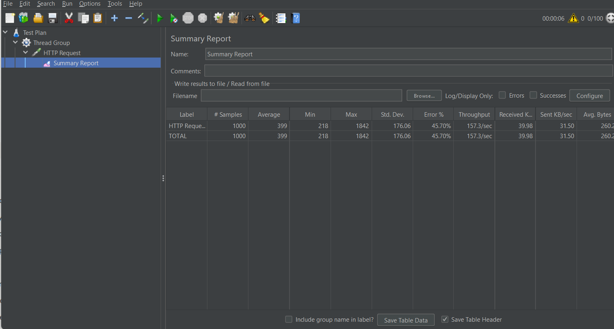

# Rate Limiter as a Service

This project is a standalone microservice that lets any backend application enforce API rate limits without building the logic themselves. Register a client, set a capacity and refill rate, and the service handles the rest using the token bucket algorithm with Redis for fast token state and PostgreSQL for persistent storage. The project is also fully dockerized and deployed on AWS EC2.

---

## Tech Stack

---

## System Architecture

  

---

## Event Flow

### Registration
1. Receive client details — clientId, capacity, refillRate
2. Check if clientId already exists — return error if it does
3. Save client configuration to PostgreSQL
4. Initialise token bucket in Redis
5. Create a ReentrantLock for this client in memory
6. Return 201 Created

### Check
1. Look up ReentrantLock for this clientId — return 429 if not found
2. Acquire the lock
3. If bucket missing in Redis — reload from PostgreSQL and reinitialise
4. Read token state from Redis
5. Calculate elapsed time and refill tokens accordingly
6. If tokens available — consume one and allow
7. If no tokens — block
8. Write updated token state back to Redis
9. Release lock
10. Return 200 if allowed, 429 if blocked

### Server Startup
1. Load all clients from PostgreSQL
2. For each client initialise bucket in Redis if not already present
3. Create ReentrantLock for each client in memory
4. Server ready to accept requests

### Dashboard
1. Browser opens dashboard.html
2. JavaScript calls GET /api/metrics every 3 seconds
3. Page updates with latest request counts automatically

---

## API Endpoints

| Method | Endpoint | Description | Request Body |
|--------|----------|-------------|--------------|
| POST | /api/clients/register | Register a new client | clientId, capacity, refillRate |
| POST | /api/clients/{clientId}/check | Check if request is allowed | — |
| GET | /api/clients/details | Get all registered client IDs | — |
| GET | /api/metrics | Get live metrics | — |
| GET | /dashboard.html | View live metrics dashboard | — |

---

## Design Decisions

**Why Token Bucket over other algorithms?**
There are several rate limiting algorithms — Fixed Window, Sliding Window, Leaky Bucket, Token Bucket. Fixed Window is simple but has a boundary problem where clients can get double their limit by timing requests at window edges. Sliding Window is accurate but memory intensive. Token Bucket strikes the right balance as it handles burst traffic naturally, refills smoothly over time and is straightforward to implement with time-based state. It is the algorithm used by most real-world APIs including Stripe and AWS.

**Why Redis for token state?**
Every single check request reads and updates token state. If this lived in PostgreSQL, every API call would hit the database which is expensive and slow at scale. Redis lives in memory, making reads and writes sub-millisecond. It is the right tool for data that changes constantly and needs to be accessed fast.

**Why PostgreSQL for client configuration?**
Client configuration (who is registered and what their limits are) needs to survive server restarts. PostgreSQL provides this durability. Redis is an in-memory store and loses all data when restarted, making it unsuitable as the sole storage for client configuration.

**Why per-client locking instead of a global lock?**
Only concurrent requests for the same client share state and risk race conditions. A global lock unnecessarily serialises requests across all clients. Using a ConcurrentHashMap of ReentrantLocks gives each client an independent lock and different clients run in parallel while correctness is still maintained within each client.

**Why both PostgreSQL and Redis together?**
PostgreSQL and Redis serve fundamentally different purposes in this system. Client configuration is written once and must persist across restarts - PostgreSQL handles this. Token state changes on every request and must be accessed with minimal latency - Redis handles this. Neither alone is sufficient, and together they eliminate each other's weaknesses.

---

## Database Design

### clients table

| Column | Type | Constraints |
|--------|------|-------------|
| id | BIGINT | Primary Key, Auto Increment |
| client_id | VARCHAR | Unique, Not Null |
| capacity | INT | Not Null |
| refill_rate | INT | Not Null |
| created_at | TIMESTAMP | Auto set on creation |

### Redis Schema

Each registered client has a hash stored in Redis:

**Key:** `bucket:{clientId}`

| Field | Type | Description |
|-------|------|-------------|
| availableTokens | String | Current token count |
| lastRefillTime | String | Last refill timestamp in milliseconds |
| capacity | String | Maximum token capacity |
| refillRate | String | Tokens added per second |

---

## Current Limitations and Future Improvements

**Horizontal scaling limitation**
Currently ReentrantLock is used for thread safety within a single instance. Running multiple instances would allow the same client to exceed their limit since locks are not shared across instances. This can be resolved by replacing ReentrantLock with Redis Lua scripts to make the read-calculate-write operation atomic inside Redis itself, eliminating the need for application-level locking entirely.

**No authentication on endpoints**
Any application can register a client or check rate limits without any form of authentication. Adding authentication would prevent unauthorised access to the service.

**Fixed token bucket per client**
Currently each client has one bucket covering all their API usage. Supporting per-endpoint rate limits, which is different limits for different endpoints of the same client would make the service more granular and production ready.

---

## Performance Benchmarks

This service was load tested using Apache JMeter with 100 concurrent virtual users against the service deployed on AWS EC2.

**Test Configuration**
- Tool: Apache JMeter 5.6.3
- Virtual Users: 100
- Total Requests: 1000
- Endpoint: `POST /api/clients/{clientId}/check`

**Results**

| Metric | Value |
|--------|-------|
| Throughput | 157.3 req/sec |
| Average Response Time | 399ms |
| Min Response Time | 218ms |
| Max Response Time | 1842ms |
| Error % | 45.7% |

> 45.7% error rate represents requests correctly blocked by the rate limiter returning 429 Too Many Requests — not server errors.

---
